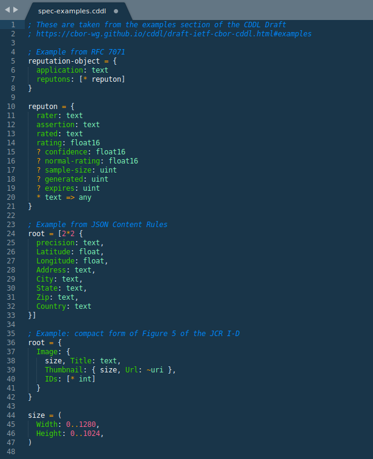
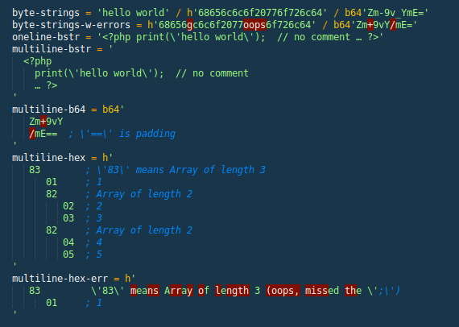

# cddl.sublime-syntax

Sublime syntax definition for the Concise data definition language (CDDL), a
notational convention to express CBOR and JSON data structures.

More information: https://datatracker.ietf.org/doc/draft-ietf-cbor-cddl/

## Examples

Highlighting inside bytestrings:

